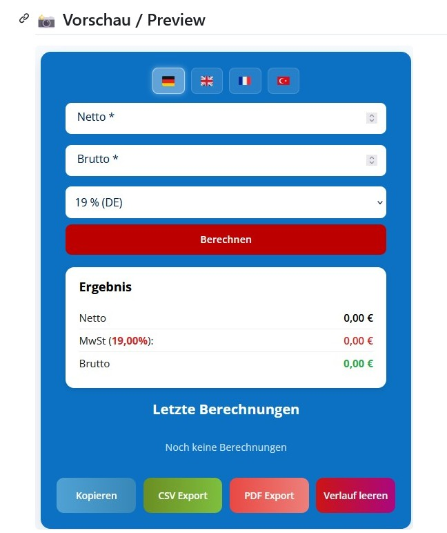

# Mehrwertsteuer Rechner – WordPress Plugin

Professioneller Mehrwertsteuer-Rechner für WordPress – berechnet Netto ↔ Brutto in Sekunden, mehrsprachig und datenschutzfreundlich.

<p align="center">
  
</p>

<p align="center">
  <a href="../../releases/download/v1.2.7/mehrwertsteuer_rechner-1.2.7.zip">
    
  </a>
</p>

> 📌 **So installierst du das Plugin:**
> 1. Klicke auf den blauen Button oben um die ZIP herunterzuladen
> 2. Gehe in WordPress zu **Plugins → Installieren → Plugin hochladen**
> 3. Wähle die heruntergeladene ZIP-Datei aus und klicke auf **Jetzt installieren**
> 4. Plugin **aktivieren** – fertig! ✅
>
> ⚠️ Bitte **nicht** den grünen „Code"-Button verwenden – der enthält den Quellcode für Entwickler, nicht das fertige Plugin!

**Aktuelle Version:** 1.2.7 | **Getestet bis:** WordPress 7.1 | **Benötigt:** PHP 7.2+

## ✨ Funktionen

- ✅ **Bidirektionale Berechnung:** Netto → Brutto und Brutto → Netto
- 🌍 **4 Sprachen:** Deutsch, English, Français, Türkçe – umschaltbar per Flaggen-Buttons
- 🇩🇪 **Vordefinierte Steuersätze:** DE (19 %, 7 %), CH (8.1 %, 7.7 %, 3.8 %, 2.6 %), AT (20 %)
- ⚙️ **Individuelle Steuersätze:** Eigene Prozentsätze frei eingeben (auch 0 %)
- 📝 **Verlauf mit Notizen:** Die letzten 10 Berechnungen inkl. Notizfunktion
- 📄 **PDF-Export:** Druckbares PDF – jsPDF lokal enthalten, kein CDN
- 📊 **CSV-Export:** Excel-kompatible Datei mit einem Klick
- 📋 **Kopieren-Funktion:** Alle Daten direkt in die Zwischenablage
- 📱 **Vollständig responsive:** Desktop, Tablet und Smartphone
- ♿ **Barrierefrei:** ARIA-Labels und Tastaturnavigation
- 🔒 **DSGVO-freundlich:** Verlauf nur im Browser (localStorage), nur anonyme Nutzungszähler in der eigenen WordPress-Datenbank, keine Übermittlung an Dritte

## 🚀 Installation

1. Die neueste ZIP von den [Releases](../../releases) herunterladen
2. In WordPress: **Plugins → Installieren → Plugin hochladen** → ZIP auswählen → aktivieren
3. Einen Shortcode auf einer Seite einfügen:

| Shortcode | Startsprache |
|---|---|
| `[mwst_rechner_de]` | Deutsch |
| `[mwst_rechner_en]` | Englisch |
| `[mwst_rechner_fr]` | Französisch |
| `[mwst_rechner_tr]` | Türkisch |

Die Sprache kann jederzeit über die Flaggen-Buttons gewechselt werden – der Shortcode legt nur die Startsprache fest.

## 🔄 Automatische Updates

Das Plugin nutzt den [Plugin Update Checker](https://github.com/YahnisElsts/plugin-update-checker) und erhält Updates automatisch über den eigenen Update-Server – ganz normal über das WordPress-Dashboard.

## 📁 Ordnerstruktur

```
mehrwertsteuer_rechner/
├── mehrwertsteuer-rechner.php    # Hauptdatei (Shortcodes, Assets, Updater)
├── readme.txt                    # WordPress-Readme
├── includes/
│   ├── class-statistics.php      # Anonyme Nutzungsstatistik (Admin-Dashboard)
│   └── plugin-update-checker/    # Update-Bibliothek (PUC 5.7)
├── assets/
│   ├── css/style.css             # Styles (auf den Rechner begrenzt)
│   ├── js/script.js              # Rechner-Logik, Verlauf, Exporte
│   ├── js/vendor/                # jsPDF + PDF-Schrift (lokal, kein CDN)
│   └── img/                      # Flaggen-Icons
└── languages/
```

## 📜 Changelog (Auszug)

**1.2.7 – 2026-08-20**
- Behoben: Eigener Steuersatz mit Komma (z. B. „7,5") wurde falsch berechnet
- Behoben: Sicherheitslücke im Notizfeld des Verlaufs (XSS)
- Behoben: Türkische Zeichen (ı, ş, ğ) im PDF-Export
- Neu: jsPDF lokal enthalten – kein CDN mehr
- Verbessert: Konsistente Rundung, CSS greift nicht mehr ins Theme ein

Vollständiger Changelog in der [readme.txt](readme.txt).

## 👤 Autor

**Samad Khakpour** – [mointools.com](https://mointools.com)

## ☕ Kostenlos & Spendenbasis

Dieses Plugin ist **kostenlos** und wird in der Freizeit entwickelt. Es gibt **keinen offiziellen Support** und keinen Anspruch auf Hilfe, Fehlerbehebungen oder neue Funktionen. Das Plugin wird so bereitgestellt, wie es ist („as is").

Wenn dir das Plugin gefällt und du die Weiterentwicklung unterstützen möchtest, freue ich mich über eine freiwillige Spende: **[github.com/sponsors/samkh244](https://github.com/sponsors/samkh244)** 💙

Fehlerberichte und Verbesserungsvorschläge kannst du gerne als [Issue](../../issues) hinterlassen – ich schaue nach Möglichkeit vorbei, kann aber keine Antwort garantieren.

## 📄 Lizenz

GPL v2 oder später – siehe [LICENSE](https://www.gnu.org/licenses/gpl-2.0.html).
Enthaltene Komponenten: [jsPDF](https://github.com/parallax/jsPDF) (MIT), [Plugin Update Checker](https://github.com/YahnisElsts/plugin-update-checker) (MIT), Roboto-Schrift (Apache 2.0, Google), Flaggen-Icons von [Flagpack](https://flagpack.xyz).
